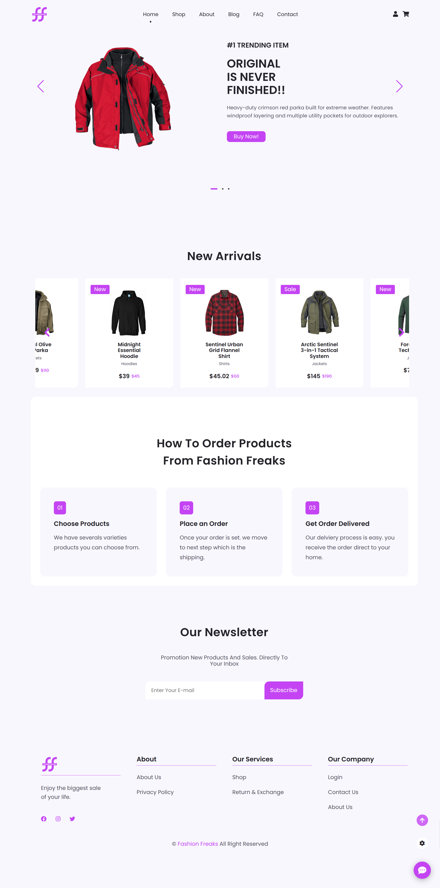
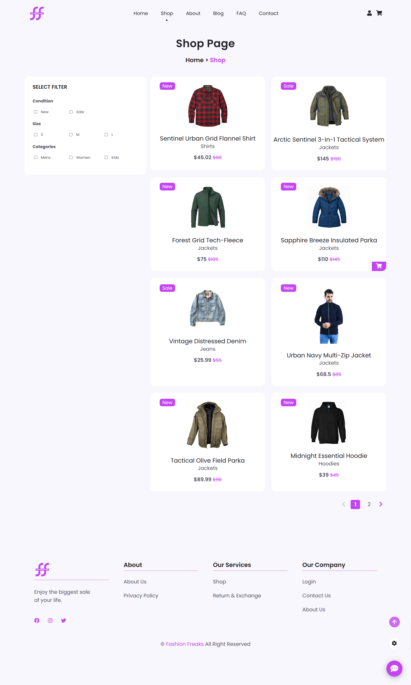
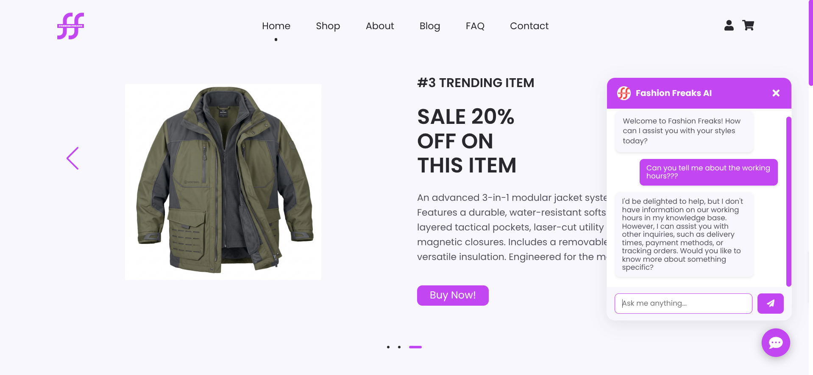
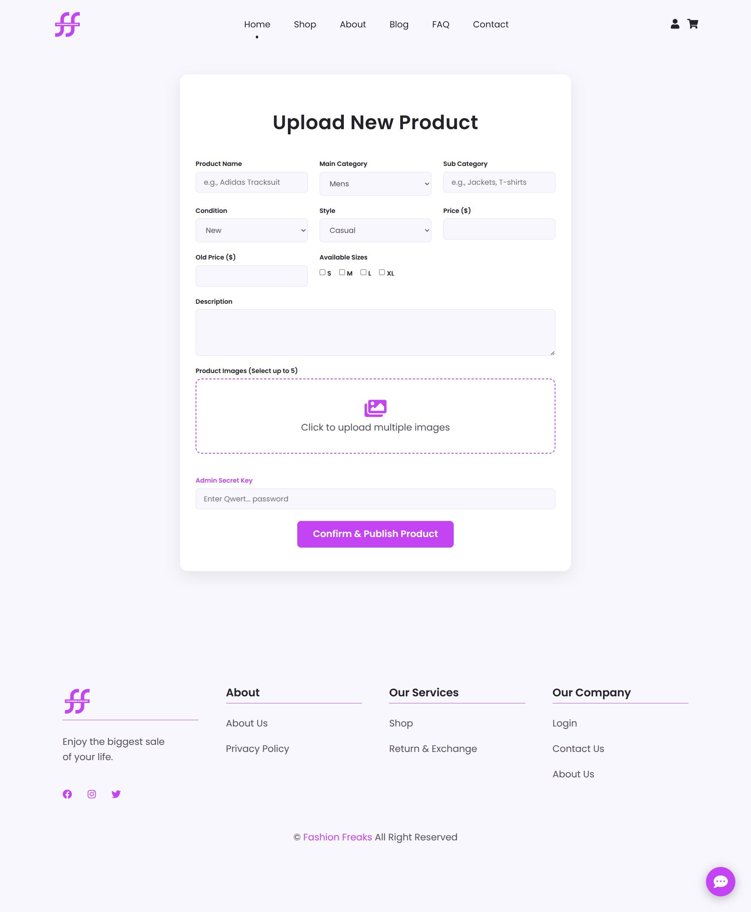
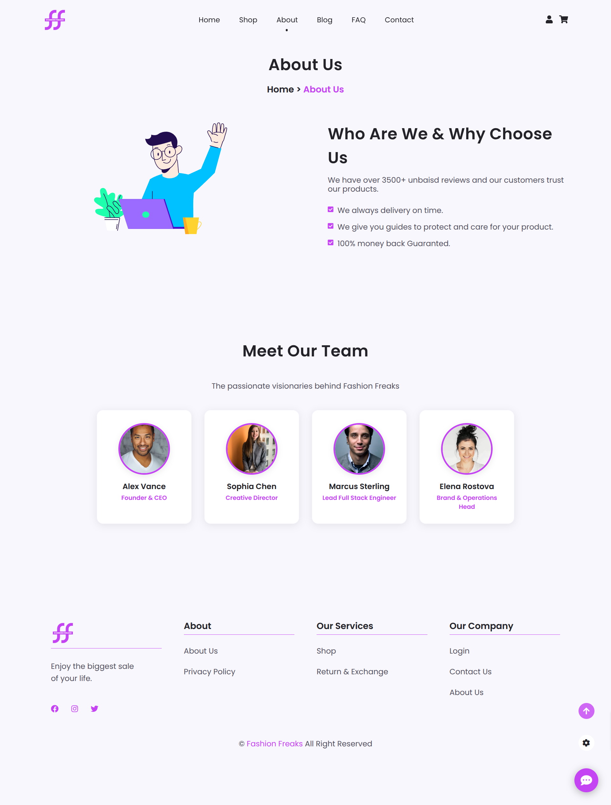
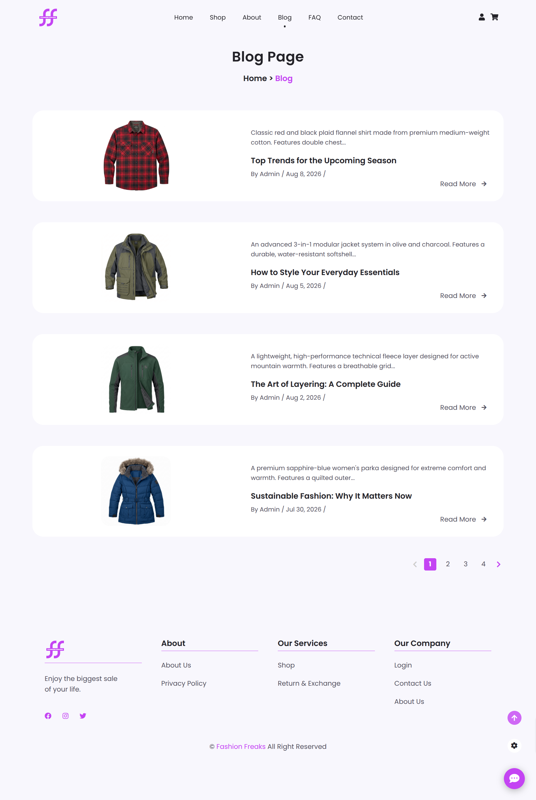

# 🛍️ Fashion Freaks — Full Stack E-Commerce & AI Customer Support Platform

Fashion Freaks is a modern full-stack e-commerce marketplace and AI-assisted online apparel store designed to provide a seamless online shopping experience for fashion enthusiasts. Built with Node.js, Express, MongoDB Atlas, Cloudinary, and Groq Llama-3.3 AI, it offers end-to-end shopping workflows, dynamic product filtering, a slide-over cart drawer, single-item detail pages with size/style selectors, a secret-key protected admin portal for multi-image product management, and a 24/7 AI virtual shopping assistant.

## 🌐 Live Demo

🔗 [View Fashion Freaks Live](https://fashion-freaks-full-stack.vercel.app/)

## 👀 Previews

### 🏠 Home Page


### 🛍️ Shop & Products Catalog


### 🤖 AI Customer Support (Fashion Freaks AI)


### ➕ Admin Add Product Portal


### ℹ️ About Us & Executive Team


### 📰 Fashion Blog & Editorial Stories


## ✨ Features

### 🛍️ Customer Shopping Experience
- **Responsive Layout & Design System**: Custom responsive UI built with HTML5, CSS3, ES6+ JS, and FontAwesome icons, featuring custom theme color switchers, dynamic header/footer loading, and mobile navigation overlays.
- **Category & Style Filtering**: Filter catalog products by main categories (*Mens*, *Women*, *Kids*) and fashion styles (*Casual*, *Dressy*, *Girly*).
- **Dynamic Slide-Over Shopping Cart**: Real-time `localStorage` synced cart drawer with item quantity increment/decrement, live badge counters, and automatic total price calculations.
- **Product Detail View**: Dedicated detail page (`details.html`) featuring multi-image galleries, size selectors (*S*, *M*, *L*, *XL*), condition badges (*New*, *Sale*), and customer review ratings.
- **Full E-Commerce Flow**: Integrated checkout, payment summary, order confirmation, policy pages (FAQ, Privacy, Return Policy), and contact support.

### 🤖 Groq Llama-3.3 AI Virtual Assistant
- **24/7 Shopping Assistant**: Floating AI chatbot widget powered by Groq API using the `llama-3.3-70b-versatile` LLM model.
- **Context-Aware Knowledge Base**: Trained on store policies, shipping timelines (3-5 business days), 30-day return policies, COD/card payment verification, and order tracking info.
- **Tactile UI Response**: Clean chat interface with auto-scrolling, typing indicators, and smooth send-button responsiveness.

### 🛡️ Admin Product Management Portal
- **Passcode Authentication**: Admin upload page (`add-product.html`) secured via secret key authorization.
- **Cloudinary Multi-Image Upload**: Drag-and-drop file upload zone supporting up to 5 images per product, stored directly in Cloudinary (`fashion-freaks` directory).
- **Product Catalog Publishing**: Complete management form to configure product titles, categories, pricing, old price comparisons, size options, descriptions, and condition flags.

## 🛠️ Tech Stack

### Frontend (Web Application)
| Technology | Purpose |
|------------|---------|
| **HTML5 & CSS3** | Semantic structure, Vanilla CSS styling, flexbox/grid layouts, and theme customizer |
| **JavaScript (ES6+)** | Dynamic component loading, DOM manipulation, state management, and `fetch` API calls |
| **FontAwesome 5** | Vector icons for navigation, action controls, and feature indicators |

### Backend (Server)
| Technology | Purpose |
|------------|---------|
| **Node.js & Express.js** | RESTful API server architecture and serverless route handlers |
| **MongoDB Atlas & Mongoose** | Managed cloud NoSQL database with indexed `Product` schemas |
| **Cloudinary SDK & Multer** | Multipart form-data image upload pipeline to Cloudinary cloud storage |
| **Groq SDK / REST API** | AI chat completions using `llama-3.3-70b-versatile` model |

### Infrastructure & Deployment
| Technology | Purpose |
|------------|---------|
| **Vercel** | Unified deployment with `@vercel/node` API routing and `@vercel/static` frontend hosting |
| **MongoDB Atlas** | High-availability cloud database cluster |

## 📁 Project Structure

```
fashion-freaks/
├── client/                  # Frontend Web Application
│   ├── public/              # Public assets (logos, images, graphics)
│   └── src/                 # Client source code
│       ├── components/      # Modular HTML components (header.html, footer.html, skeletonAnimation.html)
│       ├── pages/           # Client views (index.html, shop.html, details.html, add-product.html, about.html, etc.)
│       ├── scripts/         # Frontend scripts (root.js, page-specific scripts)
│       └── styles/          # Design system stylesheets (root.css, page-specific styles)
├── previews/                # Showcase screenshots for documentation
│   ├── about_page.png
│   ├── add_product_page.png
│   ├── ai_chat_support.png
│   ├── blog_page.png
│   ├── home_page.png
│   └── products_page.png
├── server/                  # Node.js + Express Backend REST API
│   ├── config/              # Cloudinary connection setup
│   ├── models/              # Mongoose Product model schema
│   ├── routes/              # Express endpoint definitions (productRoutes.js)
│   ├── .env                 # Server environment variables
│   ├── package.json         # Server dependencies & scripts
│   └── server.js            # Express server entry point & Groq AI Chatbot endpoint
├── vercel.json              # Vercel serverless routing configuration
└── README.md                # Documentation
```

## 🔌 API Endpoints

### Product Management Routes (`/api/products`)
| Method | Endpoint | Description |
|--------|----------|-------------|
| `POST` | `/api/products/add` | Publishes a new product with Cloudinary image upload & secret key auth |
| `GET` | `/api/products/all` | Retrieves all product listings sorted by newest creation date |
| `GET` | `/api/products/:id` | Fetches single product details by MongoDB document ID |

### AI Chatbot Route (`/api/chatbot`)
| Method | Endpoint | Description |
|--------|----------|-------------|
| `POST` | `/api/chatbot` | Processes customer support queries using Groq Llama-3.3 model |

## 🗄️ Database Schema

The database uses MongoDB Atlas managed via the Mongoose `Product` model.

### `Product` Schema
- `_id` — ObjectId (Primary Key) — Unique product identifier
- `name` — String (Required) — Product title
- `category` — String (Required) — Main category (`Mens`, `Women`, `Kids`)
- `subCategory` — String (Required) — Subcategory (`Jackets`, `T-shirts`, `Shorts`, etc.)
- `condition` — String (Enum: `["New", "Sale"]`, Default: `"New"`) — Item condition tag
- `style` — String (Enum: `["Casual", "Dressy", "Girly"]`, Required) — Fashion style tag
- `sizes` — Array of Strings — Available sizes (`["S", "M", "L", "XL"]`)
- `price` — Number (Required) — Product price in USD ($)
- `oldPrice` — Number — Original price prior to discount
- `reviews` — Number (Default: `0`) — Review score count
- `description` — String (Required) — Product description text
- `images` — Array of Objects (`url`, `publicId`) — Cloudinary image references
- `createdAt` / `updatedAt` — Timestamps — Creation & update date records
